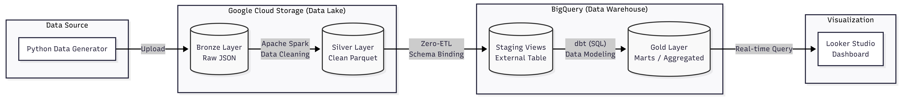
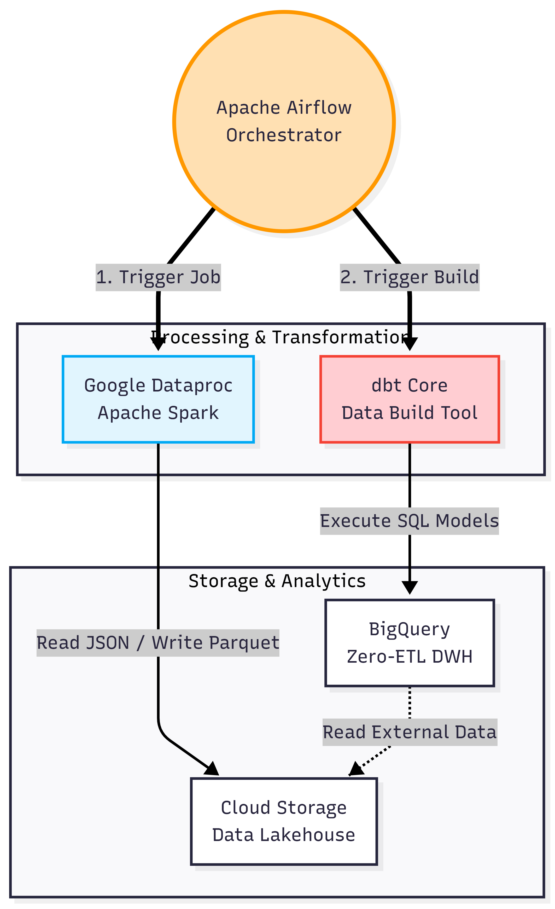
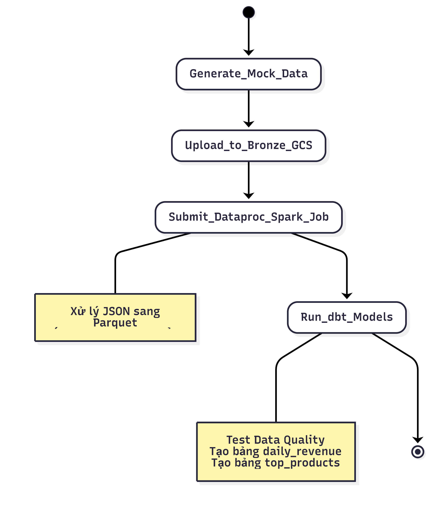
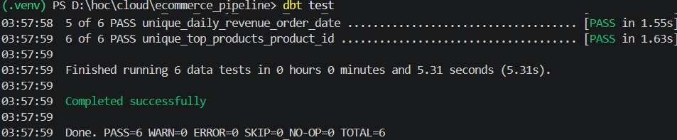
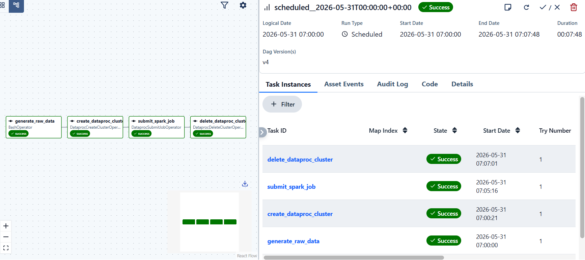
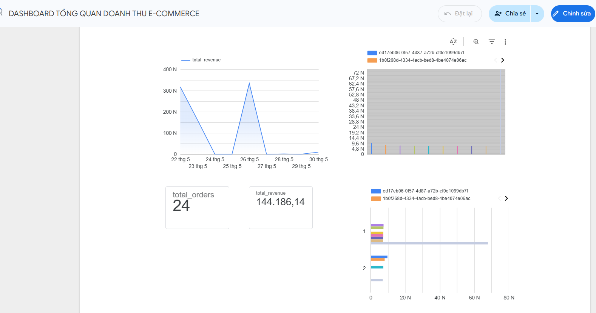

🏗️ E-Commerce Data Lakehouse on GCP

<div align="center">


*An end-to-end Data Engineering portfolio project implementing a Modern Data Stack, Zero-ETL architecture, and FinOps optimization on Google Cloud Platform.*

</div>

---

## 📌 Overview

**Business Problem:** Processing large volumes of decentralized e-commerce transaction data requires a robust system to automate data flows, ensure data integrity (no duplicates, no missing values), and optimize cloud storage/compute costs (FinOps) for Business Intelligence reporting.

**Solution:** This project builds a scalable **Modern Data Stack Pipeline**. Raw data (JSON) is generated and ingested into a Data Lake (Google Cloud Storage). Apache Airflow orchestrates an ephemeral Dataproc (Spark) cluster to clean and transform the data into Apache Iceberg (Parquet) format. BigQuery queries this data directly via Zero-ETL, while dbt handles data modeling and quality testing before serving it to Looker Studio.

**Key Metrics Delivered:**
* 📊 **Daily Revenue:** Tracking total revenue fluctuations day-by-day.
* 📈 **Top Products Analysis:** Ranking the top 10 best-selling products by volume and revenue.
* 🛒 **Total Orders:** Monitoring the total count of valid, quality-tested orders.

---

## 🏛️ Architecture

The system utilizes a Medallion Architecture (Bronze -> Silver -> Gold) to progressively refine data.



*Figure 1: High-level system architecture and data flow.*

---

## 🛠️ Tech Stack



| Layer | Technology | Purpose |
|---|---|---|
| **Ingestion** | Python (`faker`, `google-cloud-storage`) | Generates mock transaction data and uploads it directly to GCS. |
| **Storage** | Google Cloud Storage (GCS) | Acts as the foundational Data Lake storing raw JSON (Bronze) and Parquet (Silver). |
| **Processing** | Apache Spark (GCP Dataproc) | Distributed processing for data cleaning, type casting, and deduplication. |
| **Table Format** | Apache Iceberg | Manages schema evolution and metadata for the Silver layer. |
| **Orchestration** | Apache Airflow | Schedules DAGs, manages task dependencies, and controls Dataproc lifecycles. |
| **Warehouse** | Google BigQuery | Reads data directly from GCS via Zero-ETL (External Tables), minimizing storage costs. |
| **Transformation**| dbt (Data Build Tool) | Executes SQL-based data modeling and automated quality testing. |
| **Visualization** | Looker Studio | Connects to BigQuery for real-time, interactive dashboarding. |

---

## 🔄 Data Pipeline & Workflow

### The Medallion Approach
* 🥉 **Bronze Layer (Raw):** Immutable raw JSON records generated and ingested continuously into GCS.
* 🥈 **Silver Layer (Cleansed):** Apache Spark processes the Bronze data (handling negative amounts, casting types, removing duplicates) and writes optimized columnar Parquet files via Apache Iceberg.
* 🥇 **Gold Layer (Business-Ready):** dbt models aggregate the Silver data into business-ready reporting tables (`daily_revenue`, `top_products`) inside BigQuery, passing strict data quality tests.

### DAG Execution Flow



*Figure 2: Automated pipeline execution via Apache Airflow DAG.*

1.  `generate_and_upload_data`: Synthesizes JSON logs and pushes to the Bronze GCS bucket.
2.  `create_dataproc_cluster`: Provisions an ephemeral Spark cluster on GCP.
3.  `submit_spark_job`: Executes the `bronze_to_silver.py` ETL script.
4.  `delete_dataproc_cluster`: Terminates the cluster immediately after job completion to save costs.
5.  `dbt_build_and_test`: Materializes BigQuery views/tables and runs `not_null` and `unique` data tests.

---

## 📁 Project Structure

```text
├── dags/
│   └── dataproc_orchestration_dag.py   # Airflow DAG definition
├── src/
│   ├── data_generator.py               # Python script for mock data ingestion
│   └── bronze_to_silver.py             # PySpark ETL job logic
├── ecommerce_pipeline/                 # dbt project directory
│   ├── models/
│   │   ├── staging/
│   │   │   └── stg_orders.sql          # Zero-ETL staging view
│   │   └── marts/
│   │       ├── daily_revenue.sql       # Aggregated daily revenue model
│   │       ├── top_products.sql        # Top products ranking model
│   │       └── schema.yml              # dbt data quality test configurations
│   ├── dbt_project.yml
│   └── profiles.yml                    # BigQuery connection configuration
├── images/
│   ├── kientruc.png
│   ├── tech_stack.png
│   └── workflow.png
├── README.md
└── requirements.txt
```

## ⚙️ Setup & Installation

### 🐳 Hybrid Architecture (Local Dev & Cloud Execution)
*Note: The `docker-compose.yaml` file located at the root directory is specifically configured for Local Development to test the Airflow DAGs. In a true Production environment, this orchestration layer would be deployed on a managed service (e.g., Cloud Composer) or a dedicated Google Compute Engine (GCE) VM.*
This project is designed with a Hybrid architecture to optimize both developer experience and cloud FinOps:
- **Local Orchestration:** The entire orchestration layer (Apache Airflow & PostgreSQL Metadata) is containerized using `Docker Compose` and runs locally. This allows for rapid DAG testing without incurring persistent cloud compute costs.
- **Cloud Execution:** Heavy-lifting tasks (Spark distributed processing, BigQuery Zero-ETL) are not executed locally. Instead, Airflow securely triggers these managed services directly on **Google Cloud Platform (GCP)**.

### Prerequisites
- Docker & Docker Compose installed on your local machine.
- A GCP Account with BigQuery, Dataproc, and GCS APIs enabled.
- A GCP Service Account Key (JSON format) with permissions for Cloud Storage, Dataproc, and BigQuery.

### Quick Start

```bash
# 1. Clone the repository
git clone <your-repo-url>
cd <repo-folder>

# 2. Set up secure environment variables
cp .env.example .env
# IMPORTANT: Open the .env file and paste your GOOGLE_CLOUD_ADC_JSON credentials.

# 3. Build and spin up the internal Airflow cluster via Docker
docker-compose up -d

# 4. Access the Airflow UI
# Open your web browser and navigate to: http://localhost:8080 
# (Pre-configured with Anonymous Admin access to bypass login for local testing)
```
## 💰 FinOps Strategy

Cost optimization is a core architectural pillar of this project, ensuring a production-grade pipeline can run with minimal financial overhead in a development environment.

| Component | Strategy | Estimated Cost |
|---|---|---|
| **Airflow** | Hosted locally during development. | $0.00 |
| **Dataproc** | **Ephemeral Clusters**: Clusters are created only when needed and deleted immediately after the Spark job finishes (~3 minutes uptime per run). | < $0.05 / run |
| **GCS** | Standard storage class. Columnar Parquet compression drastically reduces footprint. | < $0.10 / month |
| **BigQuery** | **Zero-ETL**: External tables read directly from GCS. No internal storage costs are incurred. | Free Tier |
| **Total** | — | **< $1.00 / month** |
### 📉 Performance & Storage Benchmark (Real-world test)
- Successfully processed a mock dataset of **~10,000 orders**.
- The transformation from the Bronze layer (JSON format) to the Silver layer (Apache Iceberg/Parquet format) reduced the storage footprint from `~15.2MB` to `~4.1MB`.
- Achieved a **73% compression rate**, which significantly optimizes subsequent BigQuery query scan costs.

### Cost Optimization Techniques

#### 1. **Ephemeral Dataproc Clusters**
- Clusters are **spun up on-demand** and terminated immediately after job completion
- Typical runtime: ~3 minutes per ETL cycle
- **Savings**: Paying only for actual compute time, not idle infrastructure

#### 2. **Zero-ETL Architecture**
- BigQuery **reads data directly** from GCS Parquet files via External Tables
- No data duplication into BigQuery storage
- **Savings**: 80%+ reduction in data warehouse storage costs

#### 3. **Columnar Storage Format**
- Apache Iceberg + Parquet compression reduces file sizes by **50-70%**
- **Savings**: Reduced storage footprint and faster query performance

#### 4. **GCS Standard Storage Class**
- Standard class for frequently accessed data
- Automatic lifecycle policies delete old Bronze/Silver data after 30 days
- **Savings**: Prevents storage bloat from historical pipeline runs

---

## 📊 Results & Testing

The project has been successfully executed end-to-end, passing all automated quality and orchestration checks:

**1. Data Quality Gates (dbt Tests):**
Achieved a 100% pass rate for all schema tests (`not_null`, `unique`) on critical columns (`transaction_id`, `amount`, `order_date`).


**2. Automated Orchestration (Airflow DAG):**
End-to-end execution of all 4 tasks (Cluster Creation -> Spark Job -> Cluster Deletion) completed successfully without bottlenecks.


**3. Business Intelligence (Looker Studio):**
Real-time interactive dashboard querying directly from the BigQuery Gold layer via Zero-ETL external tables.


## 🚀 Future Work
Migrate Apache Airflow from local deployment to Google Cloud Composer for fully managed 24/7 orchestration.

Implement Terraform (IaC) to automate the provisioning of GCS buckets, BigQuery datasets, and Dataproc configurations.

Integrate a Schema Registry to support robust streaming ingestion via Apache Kafka.

Set up CI/CD pipelines using GitHub Actions for automated dbt testing on pull requests.

## 👤 Author
Đặng Bùi Thanh Tùng Final-year Information Technology Student (Data Engineering Specialization) Dai Nam University (Expected Graduation: June 2026)